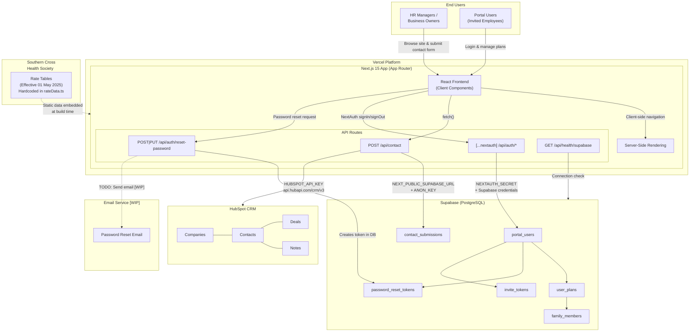
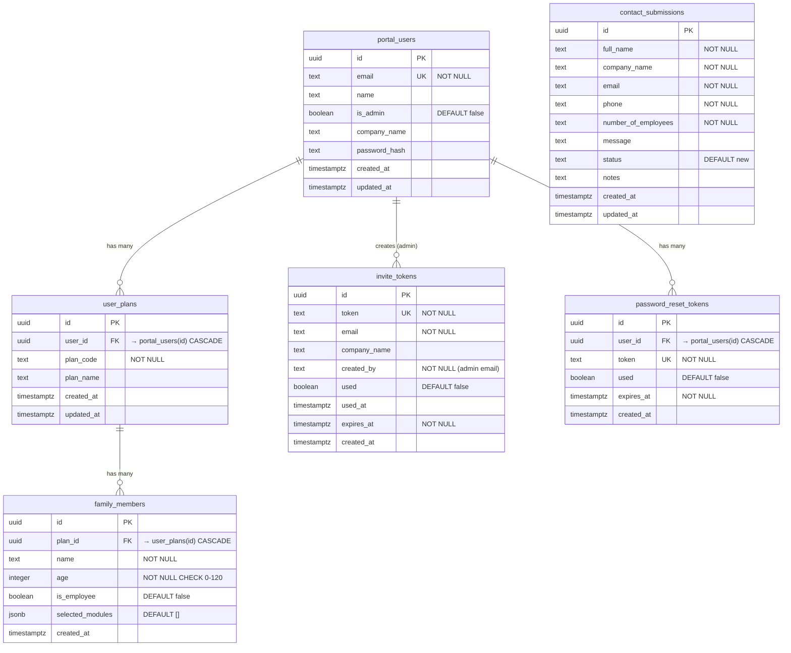
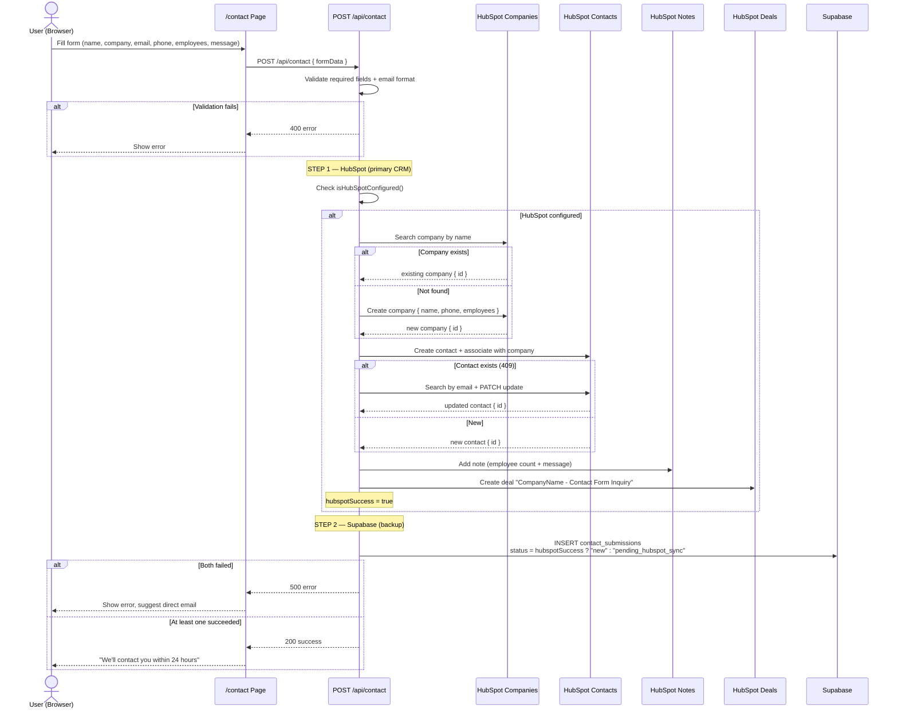

# BoostWellbeing Architecture

## Diagram 1: System Architecture Overview

---

## Diagram 2: Frontend Routing & Component Tree

```mermaid
graph TD
    subgraph RootLayout["RootLayout (layout.tsx) — Providers: SessionProvider"]

        subgraph PublicRoutes["Public Routes"]
            Home["/ — HomePage"]
            About["/about — AboutPage"]
            Contact["/contact — ContactPage"]
            Survey["/survey — SurveyPage"]
            GroupHealth["/group-health — GroupHealthPage"]
        end

        subgraph V2aRoutes["V2a Routes (alternate design)"]
            V2aHome["/v2a — V2a Homepage"]
            V2aCases["/v2a/case-studies"]
            V2aContact["/v2a/contact"]
            V2aHow["/v2a/how-it-works"]
            V2aRes["/v2a/resources"]
        end

        subgraph AuthRoutes["Auth Routes (public)"]
            Login["/portal/login"]
            Register["/portal/register"]
            ForgotPw["/portal/forgot-password"]
            ResetPw["/portal/reset-password"]
        end

        subgraph ProtectedRoutes["Protected Routes (require session)"]
            Dashboard["/portal — Dashboard"]
            PlanSel["/portal/plan-selector"]
            Admin["/portal/admin"]
        end

        subgraph API["API Routes"]
            APIContact["POST /api/contact"]
            APIAuth["/api/auth/[...nextauth]"]
            APIReset["/api/auth/reset-password"]
            APIHealth["/api/health/supabase"]
        end
    end

    subgraph Components["Components"]
        ScrollVideo["ScrollVideoBackground"]
        BoostIconC["BoostIcon"]
        WPA["WorkplaceWellbeingAssessment"]
        WR["WellbeingResults"]
        THC["TeamHealthCalculator"]
        PS["PlanSelector"]
        CS["CostSummary"]
        FM["FamilyMembers"]
    end

    subgraph TurtleUI["TurtleUI Library"]
        TCalc["Calculator, CalculatorSection,<br/>CalculatorRow"]
        TSlider["Slider"]
        TQuote["QuoteCard, QuoteResultLine,<br/>QuoteInfoBox"]
        TUnused["UNUSED: Toggle, FAQ, TrustBadge,<br/>ReviewCard, EmailCapture, ContactForm"]
    end

    Home -->|uses| ScrollVideo
    Home -->|uses| BoostIconC
    Contact -->|uses| ScrollVideo
    Contact -->|uses| BoostIconC
    Survey -->|uses| WPA
    WPA -->|renders on complete| WR
    GroupHealth -->|uses| THC
    PlanSel -->|uses| PS
    PlanSel -->|uses| CS
    PlanSel -->|uses| FM
    THC -->|imports| TCalc
    THC -->|imports| TSlider
    THC -->|imports| TQuote

    Contact -->|"POST"| APIContact
    Login -->|"signIn()"| APIAuth
    ForgotPw -->|"POST"| APIReset
    ResetPw -->|"PUT"| APIReset
```

---

## Diagram 3: Database Schema (Entity Relationship)

---

## Diagram 4: Data Flow — Contact Form Submission

---

## Environment Variables

| Variable | Service | Used By |
|----------|---------|---------|
| `NEXT_PUBLIC_SUPABASE_URL` | Supabase | `src/lib/supabase.ts` |
| `NEXT_PUBLIC_SUPABASE_ANON_KEY` | Supabase | `src/lib/supabase.ts` |
| `HUBSPOT_API_KEY` | HubSpot CRM | `src/lib/hubspot.ts` |
| `NEXTAUTH_URL` | NextAuth | `src/lib/auth.ts` |
| `NEXTAUTH_SECRET` | NextAuth | `src/lib/auth.ts` |

## WIP / Incomplete Features

| Feature | Location | Status |
|---------|----------|--------|
| Password reset email sending | `src/app/api/auth/reset-password/route.ts:54` | TODO — token created but email not sent |
| Admin dashboard functionality | `src/app/portal/admin/page.tsx` | Basic UI only |
